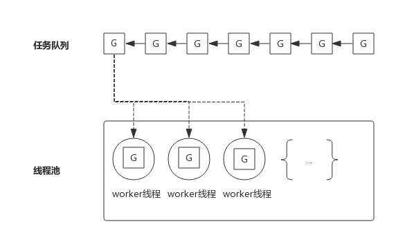
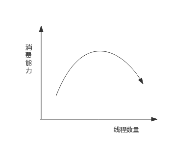
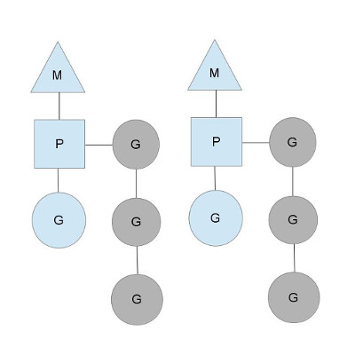
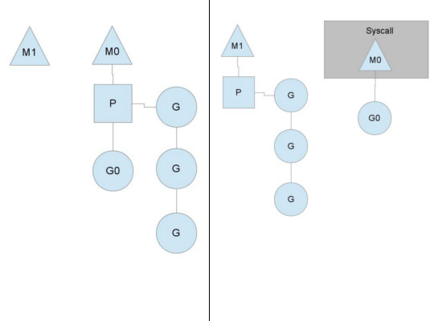
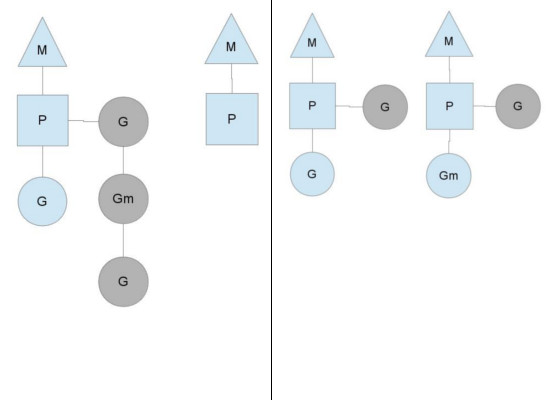

### 线程池
典型的线程池:

把任务队列中的每一个任务称作G，而G往往代表一个函数。线程池中的线程worker线程不断的从任务队列中取出任务并执行。而worker线程的调度则交给操作系统进行调度。

如果worker线程执行的G任务中发生系统调用，则操作系统会将该线程置为阻塞状态，也意味着该线程在怠工，也意味着消费任务队列的worker线程变少了，也就是说线程池消费任务队列的能力变弱了。

如果任务队列中的大部分任务都会进行系统调用，则会让这种状态恶化，大部分worker线程进入阻塞状态，从而任务队列中的任务产生堆积。

解决这个问题的一个思路就是重新审视线程池中线程的数量，增加线程池中线程数量可以一定程度上提高消费能力，

但随着线程数量增多，由于过多线程争抢CPU，消费能力会有上限，甚至出现消费能力下降。 如下图所示：

### go协程 

Go提供一种机制，可以在线程中自己实现调度，上下文切换更轻量，从而达到了线程数少，而并发数并不少的效果。而线程中调度的就是Goroutine.

Goroutine主要概念如下：

G（Goroutine）: 即Go协程，每个go关键字都会创建一个协程。

M（Machine）： 工作线程，在Go中称为Machine,由操作系统调度。

P(Processor): 处理器（Go中定义的一个摡念，不是指CPU），包含运行Go代码的必要资源，也有调度goroutine的能力。

M必须拥有P才可以执行G中的代码，P含有一个包含多个G的队列，P可以调度G交由M执行。其关系如下图所示：

图中M是交给操作系统调度的线程，M持有一个P，P将G调度进M中执行。P同时还维护着一个包含G的队列（图中灰色部分），可以按照一定的策略将G调度进M中执行。

P的个数在程序启动时决定，默认情况下等同于CPU的核数，程序中可以使用runtime.GOMAXPROCS()设置P的个数，在某些IO密集型的场景下可以在一定程度上提高性能。

M个数通常稍大于P个数,因为除了运行go代码,runtime包还由其他内置任务需要处理。

一般来说,处理器P中的协程G额外再船舰的协程会被加入到本地的runqueues(G队列),但如果本地的队列已满，或阻塞的协程被唤醒，则协程会被放入全局的runqueues中,

处理器P除了调度本地的runqueues中的协程，还会周期性的从全局runqueues中摘取协程来调度。

上面说到P的个数默认等于CPU核数，每个M必须持有一个P才可以执行G，一般情况下M的个数会略大于P的个数，

多出来的M将会在G产生系统调用时发挥作用。类似线程池，Go也提供一个M的池子，需要时从池子中获取，用完放回池子，不够用时就再创建一个。

### 调度策略

如图所示，当G0即将进入系统调用时，M0将释放P，进而某个空闲的M1获取P，继续执行P队列中剩下的G。

M0由于陷入系统调用而进被阻塞，M1接替M0的工作，只要P不空闲，就可以保证充分利用CPU。

M1的来源有可能是M的缓存池，也可能是新建的。当G0系统调用结束后，跟据M0是否能获取到P，将会将G0做不同的处理：

如果有空闲的P，则获取一个P，继续执行G0。

如果没有空闲的P，则将G0放入全局队列，等待被其他的P调度。然后M0将进入缓存池睡眠。

### 工作量窃取
多个P中维护的G队列有可能是不均衡的，比如下图：

竖线左侧中右边的P已经将G全部执行完，然后去查询全局队列，全局队列中也没有G，而另一个M中除了正在运行的G外，

队列中还有3个G待运行。此时，空闲的P会将其他P中的G偷取一部分过来，一般每次偷取一半。偷取完如右图所示。

### 抢占式调度

所谓抢占式调度，是指避免某个协程长时间执行，而阻碍其他协程被调度的机制。

调度器会监控每个协程的执行时间，一旦执行时间过长且有其他协程在等待时，会把协程暂停，转而调度等待的协程，

以达到类似于时间片轮转的效果。

###GOMAXPROCS设置对性能的影响
一般来讲，程序运行时就将GOMAXPROCS大小设置为CPU核数，可让Go程序充分利用CPU。在某些IO密集型的应用里，这个值可能并不意味着性能最好。

理论上当某个Goroutine进入系统调用时，会有一个新的M被启用或创建，继续占满CPU。但由于Go调度器检测到M被阻塞是有一定延迟的，

也即旧的M被阻塞和新的M得到运行之间是有一定间隔的，所以在IO密集型应用中不妨把GOMAXPROCS设置的大一些，或许会有好的效果。