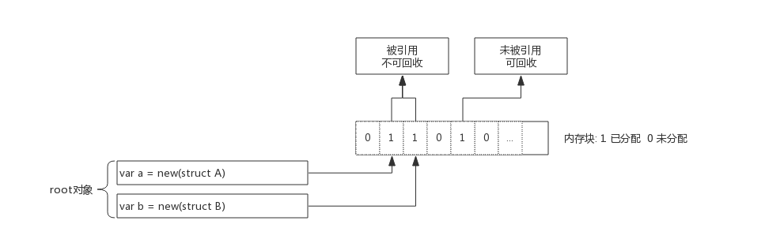
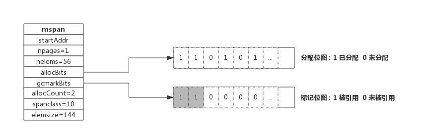
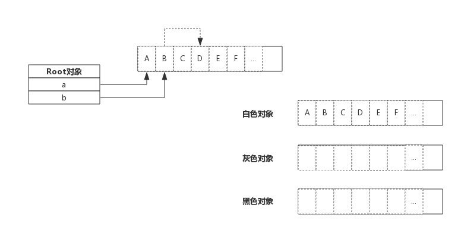
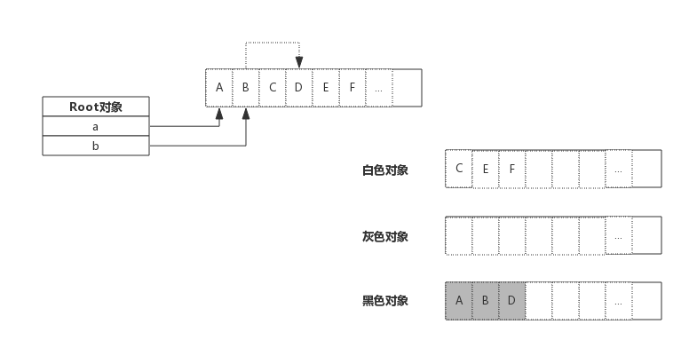

### 垃圾回收原理

下图展示了一段内存，内存中即有已分配掉的内存，也有未分配的内存，垃圾回收的目标就是把那些已经分配的但没有对象引用的内存找出来并回收掉：


垃圾回收开始时从root对象开始扫描，把root对象引用的内存标记为"被引用"，考虑到内存块中存放的可能是指针，
所以还需要递归的进行标记，全部标记完成后，只保留被标记的内存，未被标记的全部标识为未分配即完成了回收。

###内存标记
前面介绍内存分配时，介绍过span数据结构，span中维护了一个个内存块，并由一个位图allocBits表示每个内存块的分配情况。
在span数据结构中还有另一个位图gcmarkBits用于标记内存块被引用情况。

allocBits记录了每块内存分配情况，而gcmarkBits记录了每块内存标记情况。
标记阶段对每块内存进行标记，有对象引用的的内存标记为1(如图中灰色所示)，没有引用到的保持默认为0.

allocBits和gcmarkBits数据结构是完全一样的，标记结束就是内存回收，
回收时将allocBits指向gcmarkBits，则代表标记过的才是存活的，gcmarkBits则会在下次标记时重新分配内存，非常的巧妙

### 三色标记法
前面介绍了对象标记状态的存储方式，还需要有一个标记队列来存放待标记的对象，可以简单想象成把对象从标记队列中取出，将对象的引用状态标记在span的gcmarkBits，把对象引用到的其他对象再放入队列中。

三色只是为了叙述上方便抽象出来的一种说法，实际上对象并没有颜色之分。这里的三色，对应了垃圾回收过程中对象的三种状态：

灰色：对象还在标记队列中等待
黑色：对象已被标记，gcmarkBits对应的位为1（该对象不会在本次GC中被清理）
白色：对象未被标记，gcmarkBits对应的位为0（该对象将会在本次GC中被清理）
例如，当前内存中有A~F一共6个对象，根对象a,b本身为栈上分配的局部变量，根对象a、b分别引用了对象A、B, 而B对象又引用了对象D，则GC开始前各对象的状态如下图所示:

初始状态下所有对象都是白色的。

接着开始扫描根对象a、b:


由于根对象引用了对象A、B,那么A、B变为灰色对象，接下来就开始分析灰色对象，分析A时，A没有引用其他对象很快就转入黑色，
B引用了D，则B转入黑色的同时还需要将D转为灰色，进行接下来的分析。如下图所示：

上图中灰色对象只有D，由于D没有引用其他对象，所以D转入黑色。标记过程结束：


最终，黑色的对象会被保留下来，白色对象会被回收掉。

### Stop The World
对于垃圾回收来说，回收过程中也需要控制住内存的变化，否则回收过程中指针传递会引起内存引用关系变化，如果错误的回收了还在使用的内存，结果将是灾难性的。

Golang中的STW（Stop The World）就是停掉所有的goroutine，专心做垃圾回收，待垃圾回收结束后再恢复goroutine。

STW时间的长短直接影响了应用的执行，时间过长对于一些web应用来说是不可接受的，这也是广受诟病的原因之一。

为了缩短STW的时间，Golang不断优化垃圾回收算法，这种情况得到了很大的改善。

### 垃圾回收优化
#### 写屏障
前面说过STW目的是防止GC扫描时内存变化而停掉goroutine，而写屏障就是让goroutine与GC同时运行的手段。虽然写屏障不能完全消除STW，但是可以大大减少STW的时间。

写屏障类似一种开关，在GC的特定时机开启，开启后指针传递时会把指针标记，即本轮不回收，下次GC时再确定。

GC过程中新分配的内存会被立即标记，用的并不是写屏障技术，也即GC过程中分配的内存不会在本轮GC中回收。

#### 辅助GC(Mutator Assist)
为了防止内存分配过快，在GC执行过程中，如果goroutine需要分配内存，那么这个goroutine会参与一部分GC的工作，即帮助GC做一部分工作，这个机制叫作Mutator Assist。

### GC触发时机
####  内存分配量达到阀值触发GC
每次内存分配时都会检查当前内存分配量是否已达到阀值，如果达到阀值则立即启动GC。

阀值 = 上次GC内存分配量 * 内存增长率

内存增长率由环境变量GOGC控制，默认为100，即每当内存扩大一倍时启动GC。
#### 定期触发GC
默认情况下，最长2分钟触发一次GC，这个间隔在src/runtime/proc.go:forcegcperiod变量中被声明：
```go
// forcegcperiod is the maximum time in nanoseconds between garbage
// collections. If we go this long without a garbage collection, one
// is forced to run.
//
// This is a variable for testing purposes. It normally doesn't change.
var forcegcperiod int64 = 2 * 60 * 1e9
```
#### 手动触发GC
程序代码中也可以使用runtime.GC()来手动触发GC。这主要用于GC性能测试和统计。
